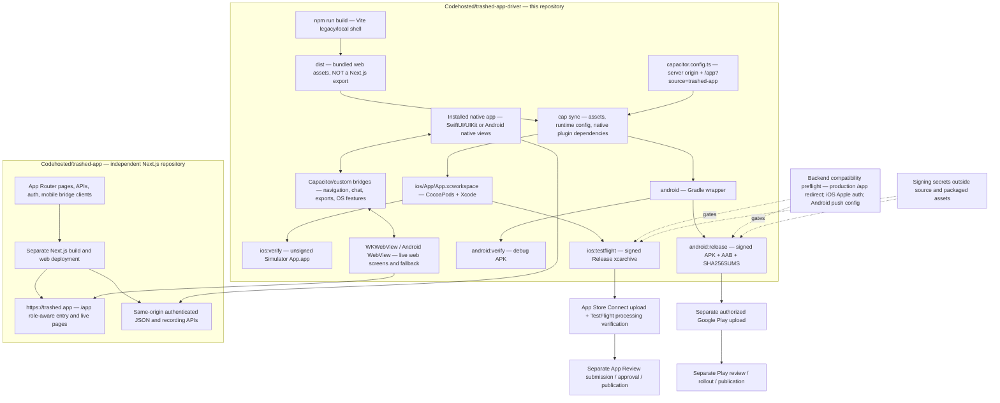

# Mobile build, runtime architecture, and release

The mobile repository **Codehosted/trashed-app-driver** owns native iOS/Android source, Capacitor configuration, native plugins, tests, signing/build scripts, and store assets. **Codehosted/trashed-app** is an independently built/deployed Next.js project: it owns the live web routes, authentication, business APIs, and web-to-native integration. Building the mobile app does **not** build or deploy Next.js.

## Architecture



### Runtime, not just a WebView

- `capacitor.config.ts` uses `webDir: 'dist'`, but configures a remote `server.url` origin (default `https://trashed.app`) plus `appStartPath: '/app?source=trashed-app'`. Vite output is copied into the native project; it is **not** the production Next.js app and does not make that app work offline. Unsetting `TRASHED_WEB_URL` still selects production; an empty value is not a supported bundled-only mode.
- Next.js `app/app/page.tsx` redirects signed-out users to `/app/login?callbackUrl=%2Fapp&source=trashed-app` and signed-in users by roles/permissions. Its `components/mobile/native-app-navigation.tsx` and `lib/mobile/*` coordinate native integration.
- Native authentication/onboarding and selected dashboard, chat, navigation, profile and call-history surfaces live in this repo. iOS uses SwiftUI/UIKit; Android uses native Java views. Some surfaces are bridge-driven; profile/call history use same-origin native API clients and OS cookie stores. This is neither a web-only wrapper nor a fully native route migration.
- Unsupported account sections, inventory/orders and other unconverted destinations remain web-owned. iOS workspace entry is availability-guarded for iOS 16+, while the project retains its iOS 14 deployment target. See [iOS direct navigation](native-direct-navigation-ios.md), [iOS workspace](native-workspace-ios.md), [Android workspace](native-workspace-android.md), and [API session safety](android-native-session-safety.md).
- Compatible web-only changes can reach existing installations after a separate web deployment. Native code/plugins/permissions/packaged configuration require rebuilding and distributing a new app. Deploy compatible backend changes **before** shipping dependent native changes; preserve compatibility with older installed clients.

## Commands and side effects

Run from this repository (not the Next.js repo). `npm run` lists the entrypoints.

| Command | What it does | Signing / upload |
| --- | --- | --- |
| `npm run mobile:preflight` | Unauthenticated GET-only production `/app` routing check | None; no login or writes |
| `npm run ios:verify -- --help` | Local verifier usage; no dependency/build work | None |
| `npm run ios:verify` | `npm ci`, Node tests, Vite build, Capacitor iOS sync/pods, Debug generic Simulator compile | No signing, archive, upload, simulator boot or phone interaction |
| `npm run android:verify` | `npm ci`, Node tests, Vite build, Android sync, Gradle debug unit tests/lint/APK | Debug signing only; no install/upload |
| `npm run android:release` | Credential/version + backend/push preflights, tests/build/sync, release unit tests/lint, APK/AAB, signature and hardware-filter checks | Release signing; **no Play upload** |
| `npm run ios:testflight` | Existing `ci-upload-testflight.sh`: backend checks, keychain/profile work, Bun install/tests/build/sync/pods, archive/export/upload, processing verification | **Uploads to Apple and changes signing state**; explicit release authorization required |

Aliases delegate to the existing release scripts rather than introduce a second shipping pipeline. No alias submits store review, deploys Next.js or sends Slack messages. Existing GitHub workflows have separate, opt-in Slack notification jobs.

## Local prerequisites and safe verification

Use a clean checkout/worktree with its own dependencies. Node 22 LTS and npm are recommended; `npm ci` uses `package-lock.json`. Existing CI uses Bun 1.1.38 with `bun.lockb`; update both locks intentionally when changing dependencies. Do not share mutable dependency/build directories between concurrent builds.

### iOS (macOS only)

Install full **Xcode 26+**, its iOS Simulator SDK/platform support, and **CocoaPods** (`pod` on PATH). Complete Xcode's first-launch/license setup yourself. Check `xcodebuild -version`, `xcode-select -p`, `xcrun --sdk iphonesimulator --show-sdk-path`, and `pod --version`. If Command Line Tools is selected, use `DEVELOPER_DIR=/Applications/Xcode.app/Contents/Developer` for the command or explicitly select the intended Xcode yourself; the verifier never changes global Xcode selection.

```sh
npm run ios:verify
# Repeat with this checkout's existing dependencies:
npm run ios:verify -- --skip-install
# Compile a wrapper configured for an independently running local Next.js server:
TRASHED_WEB_URL=http://localhost:3000 npm run ios:verify -- --skip-install
```

`TRASHED_WEB_URL` must be an HTTP(S) origin without credentials/path/query/fragment. The script uses the checked-in workspace and `App` scheme, explicit `generic/platform=iOS Simulator`, Debug configuration, and `CODE_SIGNING_ALLOWED=NO`. It never selects a device, installs an app or invokes signing tools. No Apple account, distribution certificate, API key, or provisioning profile is required for this compile check. OAuth/push runtime and signed installation remain separate tests.

Each invocation retains a unique ignored `build/ios-verify.XXXXXX/` directory. `xcodebuild.log` and `DerivedData/Build/Products/Debug-iphonesimulator/App.app` are inside it; failures print the directory and propagate a nonzero status. Older build output is never deleted. Capacitor sync regenerates native assets/configuration and resolves pods; inspect `git diff` afterward. This is compilation plus repository tests, **not** simulator UI, authentication, device, push or store certification.

**Do not bundle secrets:** Vite currently substitutes `GEMINI_API_KEY` into client JavaScript and supports public `VITE_*` values. The verifier rejects `.env`, `.env.local`, `.env.production`, `.env.production.local`, nonempty `GEMINI_API_KEY`/`API_KEY`/`VITE_*` environment variables, and a symlinked `node_modules`. Use a clean build worktree, not one holding backend credentials. Never copy Next.js `.env` files into this repo or into native assets. The legacy Android/TestFlight scripts are not a general secret scanner; the same clean-worktree rule applies to them.

### Android

Install **JDK 21**, Android SDK platform **36**, build-tools **36.0.0**, and accepted SDK licenses, as in `android-checkpoint.yml`. Set `JAVA_HOME` and `ANDROID_HOME`/`ANDROID_SDK_ROOT` (or local `android/local.properties`). Use the checked-in `android/gradlew`. For release verification, set `APKSIGNER_BIN` to the SDK build-tools `apksigner` when it is not on PATH; adjacent `aapt2` and JDK `jarsigner` are required. Explicit `APKSIGNER_BIN` also avoids platform-specific version-sorting discovery on macOS. Checksums use `sha256sum`, with macOS `shasum -a 256` fallback.

Default output is ignored `artifacts/android/`: debug APK or release APK/AAB plus `SHA256SUMS`. `ARTIFACT_DIR` can select a dedicated build-output directory. The script replaces only its own named outputs, not arbitrary directory contents; checksums include only the artifacts from the selected build mode. Keep unrelated files and signing material elsewhere; distribute individual artifacts, never an arbitrary parent directory. `GRADLE_USER_HOME` defaults to isolated `android/.gradle-user`. Both Android modes explicitly target production web configuration; verification does not install/launch the APK.

## Shipping contracts (do not run casually)

### Android signed artifacts

Provide an unused `TRASHED_ANDROID_VERSION_CODE`, intended `TRASHED_ANDROID_VERSION_NAME`, readable `TRASHED_ANDROID_KEYSTORE`, `TRASHED_ANDROID_KEY_ALIAS`, `TRASHED_ANDROID_KEYSTORE_PASSWORD`, and `TRASHED_ANDROID_KEY_PASSWORD` through your approved secret mechanism. The script fails before network/build/cleanup when required signing inputs are missing. It runs backend and Android Firebase/push configuration checks, validates signatures, and emits an APK and AAB. Uploading the AAB, choosing a track, completing review and confirming rollout are **separate authorized steps**; no Play-upload script/workflow is included here.

### iOS TestFlight

Prefer the existing macOS CI workflow. Local use requires an isolated signing environment, writable `RUNNER_TEMP`, Xcode, Bun, CocoaPods, Python 3, curl, Fastlane and macOS signing tools. Inputs include `APP_STORE_CONNECT_KEY_ID`, `APP_STORE_CONNECT_ISSUER_ID`, `APP_STORE_CONNECT_API_KEY_P8_BASE64` (or `APP_STORE_CONNECT_API_KEY_P8`), `GOOGLE_IOS_CLIENT_ID`, `IOS_DISTRIBUTION_CERTIFICATE_BASE64`, and `IOS_DISTRIBUTION_CERTIFICATE_PASSWORD`. Optional release controls include `BUILD_NUMBER`, `MARKETING_VERSION`, `DEVELOPMENT_TEAM_ID`, `BUNDLE_ID`, and `PROVISIONING_PROFILE_SPECIFIER`. Choose/verify release identity explicitly; npm package version is not the store version.

The script creates/imports a signing keychain, renews the named profile, checks Apple sign-in/production APNs/distribution entitlements, rewrites native release version/profile settings, archives under `build/TestFlightArchive-<build>/`, validates privacy strings and packaged push support, and exports with `destination=upload` under `build/TestFlightExport-<build>/`. This is **not** a local IPA-only command. Private keys/certificates/profile intermediates go to runner temp/keychain, never `dist` or an uploaded artifact directory. Do not run on a shared developer keychain without reviewing these effects.

`fastlane verify_testflight` waits for the exact version/build to become `VALID` and internally testable. It does not notify testers, submit App Review, or prove external beta approval/publication. See [iOS signing/review notes](ios-app-review-2026-09-10.md); historical verification logs are not current release readiness.

### Backend compatibility preflight boundaries

`check-mobile-backend.mjs` checks the **fixed production host**, even if a local build URL differs: GET `/app`, no credentials, no redirect following, expected HTTP 307 to same-origin `/app/login` with exactly the mobile callback/source parameters. It does not test all API contracts or signed-in behavior. TestFlight additionally checks `/api/auth/mobile/apple` for provider, audience `com.trashed.driver`, protocol version and configured status before signing. Android release and checkpoint CI validate Android push configuration. These gates do not prove push delivery, account permissions, or device readiness.

## Existing CI triggers — unchanged

- `.github/workflows/android-checkpoint.yml`: `workflow_dispatch` or reusable `workflow_call`; Ubuntu, Bun, JDK 21, API 36 SDK; backend/push preflight, Vite/sync, debug unit tests/lint/app APK/instrumentation APK. It uploads QA APKs, checksums, commit evidence and reports with 14-day retention. Building the instrumentation APK does **not** execute device tests. It does not invoke `ci-build-android.sh` or upload to Play.
- `.github/workflows/testflight.yml`: manual dispatch with independent `build_ios`/`build_android` inputs, or **push to main matching its path filter** (including `package.json`, native iOS sources, mobile shared source/config, locks and shipping scripts). Automatic matching pushes upload iOS; the reusable Android checkpoint is manual-only through this workflow. The macOS job selects Xcode 26 and invokes `ci-upload-testflight.sh`.
- Conditional `notify-ios`/`notify-android` jobs run only when `SLACK_APP_UPDATES_ENABLED == 'true'`. Running local aliases does not invoke those jobs. A future merge of `package.json` changes can trigger a real TestFlight upload; review release authorization and configured CI secrets before merging.

## Maintenance checks

```sh
node --test tests/mobile-build-tooling.test.mjs
npm test
bash -n scripts/verify-ios.sh scripts/ci-build-android.sh scripts/ci-upload-testflight.sh
git diff --check
```

The tooling tests verify aliases, help/argument safety, command ordering, generic unsigned Simulator destination, build-failure propagation, environment-file rejection and Android output/checksum contracts. Native release signatures and device behavior require their separate real gates; mocked command tests do not certify them.
